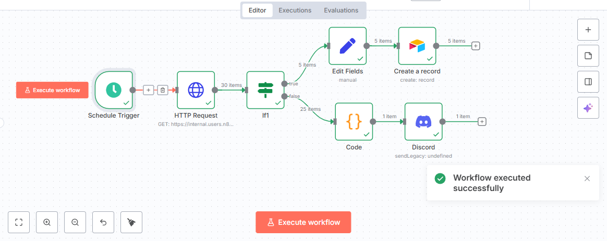

# 🎉 Completed n8n Level One Course 🎉

**Author:** Muhammad Awais

I’m excited to share that I've successfully completed the **n8n Level One Course** and built my very first automated workflow. Below is a detailed explanation of how my workflow is set up and how it runs.

## ⏰ Workflow Trigger

* **Schedule Trigger** → The workflow is set to start **every Monday at 9:00 PM**. This allows me to fully automate the process without having to execute it manually.

## 🌐 Data Collection

* **HTTP Request** → The workflow makes a request to an API endpoint and retrieves **30 items** of data. This step is where all the information comes from, feeding into the rest of the automation.

## 🔀 Data Filtering

* **IF Node** → Once the data is collected, this node checks each item against a condition and splits the flow into two paths:

  * **True Path (5 items)** → Data that matches the condition.
  * **False Path (25 items)** → Data that does not match the condition.

## ✏️ True Path Processing

For the data that meets the condition (True Path):

* **Edit Fields** → Adjusts and cleans the fields in the data to make it usable.
* **Create Record** → Stores the cleaned data into a **database/record system** for safekeeping and future use.

## 💻 False Path Processing

For the data that does not meet the condition (False Path):

* **Code Node** → Executes custom JavaScript logic to further process or transform the data.
* **Discord Node** → Sends the processed information directly into a **Discord channel**, allowing instant updates and visibility.

## ✅ Successful Execution

At the end of the process, n8n shows a confirmation message: **“Workflow executed successfully.”** 

## 🚀 Key Learnings

Through this project, I learned how n8n can:

* Run workflows automatically on a **schedule**
* Fetch and **collect data from APIs**
* **Filter and split** data based on conditions
* **Process and clean** data before storage
* **Store records** in a database
* **Send notifications** directly to platforms like Discord

---

© 2025 Muhammad Awais. All rights reserved.
